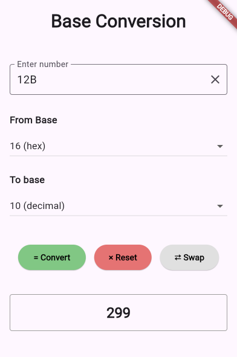

# Base Converter App

A simple Flutter application for converting numbers between different bases (binary, octal, decimal, and hexadecimal).

## Features

- Convert numbers between four bases:
  - Binary (base 2)
  - Octal (base 8)
  - Decimal (base 10)
  - Hexadecimal (base 16)
- Intuitive UI with clear input/output fields
- Swap bases with a single button
- Reset functionality
- Input validation for each base

## Screenshots

## Installation

1. Ensure you have Flutter and Dart installed on your machine
2. Clone this repository
3. Run `flutter pub get` to install dependencies
4. Run `flutter run` to launch the app

## Usage

1. Enter a number in the input field
2. Select the base of your input number from the "From Base" dropdown
3. Select the base you want to convert to from the "To Base" dropdown
4. Press the "Convert" button to see the result
5. Use "Reset" to clear all fields or "Swap" to exchange the from/to bases

## Input Restrictions

The app automatically restricts input based on the selected "From Base":
- Binary (base 2): only 0 and 1
- Octal (base 8): digits 0-7
- Decimal (base 10): digits 0-9
- Hexadecimal (base 16): digits 0-9 and letters A-F (case insensitive)

## Technical Details

- Built with Flutter framework
- Uses Material Design components
- State management handled with setState
- Input validation with regular expressions

## Dependencies

- Flutter SDK
- Dart SDK
- Material Design package (included with Flutter)

## License

MIT License with Non-Commercial Clause
